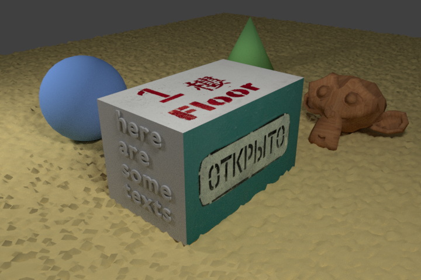
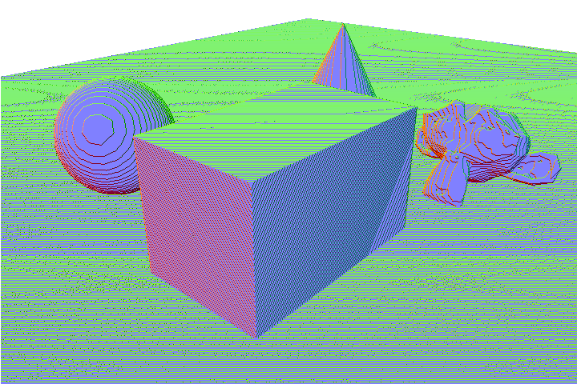
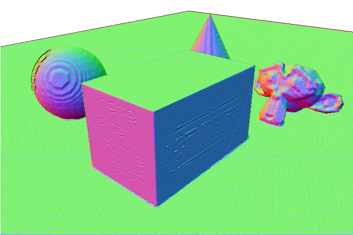

ShadingBasedRefinement
======================

A implemention of paper 'Wu, C., Zollhöfer, M., Nießner, M., Stamminger, M., Izadi, S., & Theobalt, C. (2014). Real-time shading-based refinement for consumer depth cameras. ACM Transactions on Graphics (ToG), 33(6), 200.'.

Node: This is my personal implemention, i.e. **UNOFFICIAL**.

Run: Just run main.m in matlab

Origin RGB:

Origin Depth(Normal form):

Refined Depth(Normal form):

Temporal smooth is not implemented yet.
